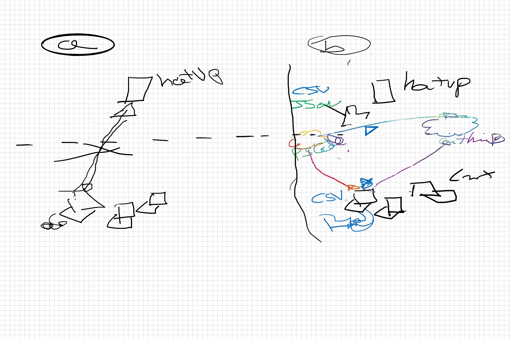

# Theme

Dans ce stream, nous aborderons les sujets comme décrit [ici](https://github.com/Stephanevg/Streams/issues/3)

# Data 

Il y a plusieurs possibilites pour telecharger les informations de declarations:

Par personne
- XML
- PDF

Les urls de telechargement des données peuvent être calculés dynamiquement à l'aide des données contenues dans 

[liste en CSV](https://www.data.gouv.fr/fr/datasets/donnees-du-repertoire-des-representants-dinterets-au-format-csv/)

/ [Liste Json](https://www.data.gouv.fr/fr/datasets/donnees-du-repertoire-des-representants-dinterets-au-format-json/)

Soit un fichier (de 30 Mo) avec toutes les déclarations de chaque déclarant au [format xml](https://www.hatvp.fr/livraison/merge/declarations.xml).

> Ce dernier fichier appeler `declarations.xml` est le fichier de base que nous aurons besoin pour notre module powershell. Il sera livré avec le module au format `.zip`, et exporter à la premiere chargement du module.

Les architectures discutés on été l'objet du diagram suivant:

# Liens

Les documents les plus importants sont disponible [ici](https://www.hatvp.fr/open-data/) (tout en bas de la page.)

http://www.hatvp.fr/livraison/opendata/opendata-structure.xlsx
